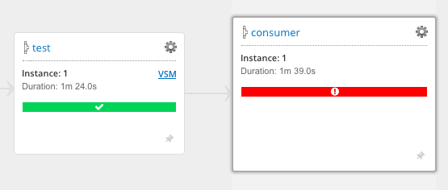
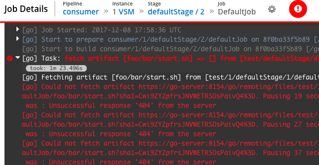
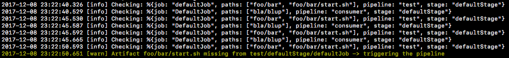

# Gorebuild

## Problem

- GoCD garbage collection can remove artifacts to not overfill the artifacts repository.
- When pipelines with high frequency or runs depend on those with lower frequency, the upstream
dependency might get garbage collected, and the downstream one fails when trying to fetch an artifact:

## Solution

Polling for the presence of pre-defined artifacts, and triggering pipelines when the artifact that should not have
been deleted has been deleted nonetheless.

TODO: The pipeline should not be triggered for previously failed or currently running pipelines

## Commentary

While the solution is not a systematically optimal one (if keeping N last artifacts is a viable feature, it should be part of GoCD), currently, it is a most pragmatic one.

### Other Links

https://github.com/gocd/gocd/issues/4022

https://github.com/gocd/gocd/issues/410

https://github.com/gocd/gocd/issues/1207

https://groups.google.com/forum/m/#!topic/go-cd/QArd6yLwhl4
