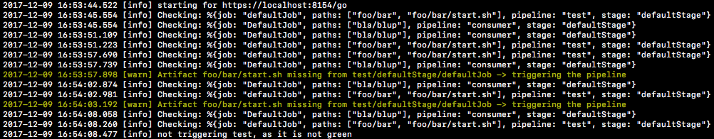

# GoRebuild

Service for triggering GoCD pipelines on demand, implemented in Elixir

contributions & other problem fixes welcome!

[](https://travis-ci.org/d-led/gorebuild)

## Problem

- GoCD garbage collection can remove artifacts to not overfill the artifacts repository.
- When pipelines with high frequency or runs depend on those with lower frequency, the upstream
dependency might get garbage collected, and the downstream one fails when trying to fetch an artifact:


## Solution

Polling for the presence of pre-defined artifacts, and triggering pipelines when the artifact that should not have
been deleted has been deleted nonetheless.

The pipeline is not triggered for previously failed or currently running pipelines



## Configuration

- see [apps/rebuildremoved/config/config.exs](apps/rebuildremoved/config/config.exs)
- If the server is not running on `localhost`, set the `GO_SERVER_URL` environment variable (e.g. `https://go-server:8154/go`), before `mix clean compile`, as standard configuration is evaluated at [compile time](https://www.amberbit.com/blog/2018/9/27/elixir-runtime-vs-compile-time-configuration/)
- For basic authentication, set `GO_USERNAME` and `GO_PASSWORD` environment variables
- The default delay (in milliseconds) is overriden via the `GO_DELAY` environment variable
- To provide the service with a list of artifacts to watch, copy an environment-specific Mix config file into `apps/buildremoved/config/`, and use a `MIX_ENV` variable to provide the config override filename, where the value corresponds to the filename (without extension) of the config file.
- The root directory in the [`Dockerfile.gorebuild`](Dockerfile.gorebuild) is `/home/elixir`

Example:

```
MIX_ENV=example GO_DELAY=1000 ./start.sh
```

## Deployment

options:

- contribute your own
- use the simple `Dockerfile` based on the Elixir image ([Dockerfile.gorebuild](Dockerfile.gorebuild))
- build `mix deps.get && mix compile` and start via `mix run --no-halt`

## Architecture

### Applications

- this project is an Elixir [umbrella application](https://elixir-lang.org/getting-started/mix-otp/dependencies-and-umbrella-projects.html#umbrella-projects)
- the intent of the umbrella application was to start multiple independent GoCD automation services with independent strategies and lifetimes
- The only project under the umbrella app is [apps/rebuildremoved](apps/rebuildremoved), solving the original problem

### Commentary

While the solution is not a systematically optimal one (if keeping N last artifacts is a viable feature, it should be part of GoCD), currently, it is a most pragmatic one.

For each pipeline, a separate process is started under the supervisor. Here, for 2 pipelines:


## Development

- Start a GoCD server, agent and gorebuild: `docker-compose up --build`
- Simulate a garbage collection via the script [simulate_gc.sh](simulate_gc.sh)

### Links to Problem Descriptions

- https://github.com/gocd/gocd/issues/4022
- https://github.com/gocd/gocd/issues/410
- https://github.com/gocd/gocd/issues/1207
- https://groups.google.com/forum/m/#!topic/go-cd/QArd6yLwhl4
